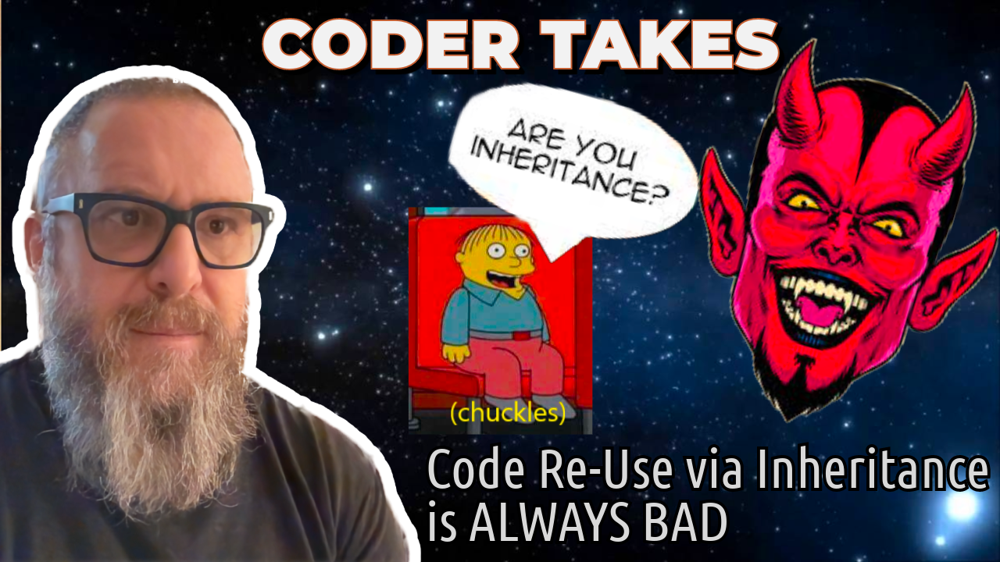

Support repo for "Code Re-Use via Inheritance is ALWAYS BAD"

Click for explainer video:

# How To Install and Run The Samples In This Guide
- [Install IntelliJ IDEA Community Edition](https://www.jetbrains.com/idea/download/)
- [How to clone this Project from Github to your local machine](https://www.jetbrains.com/guide/java/tips/clone-project-from-github/#:~:text=Clone%20a%20project%20from%20the%20IntelliJ%20IDEA%20welcome%20screen&text=Click%20Get%20from%20VCS%2C%20specify,into%20an%20IntelliJ%20IDEA%20project.)
- Navigate to this `README.md` file in the project and click on the links to the live sample code.
- In the left-hand gutter, click on the green arrow to run the sample code.

  

## My Free Course: "How To Program From The Ground Up"

Check out my free course on YouTube: ["How to Program from the Ground Up"](https://www.youtube.com/playlist?list=PLzUxWOrVXB4QHsURai1GmmhmqAUVNbfno)

Free follow along document: ["How to Program From The Ground Up Follow Along Guide"](https://github.com/realityexpander/How_to_program_from_ground_up)

